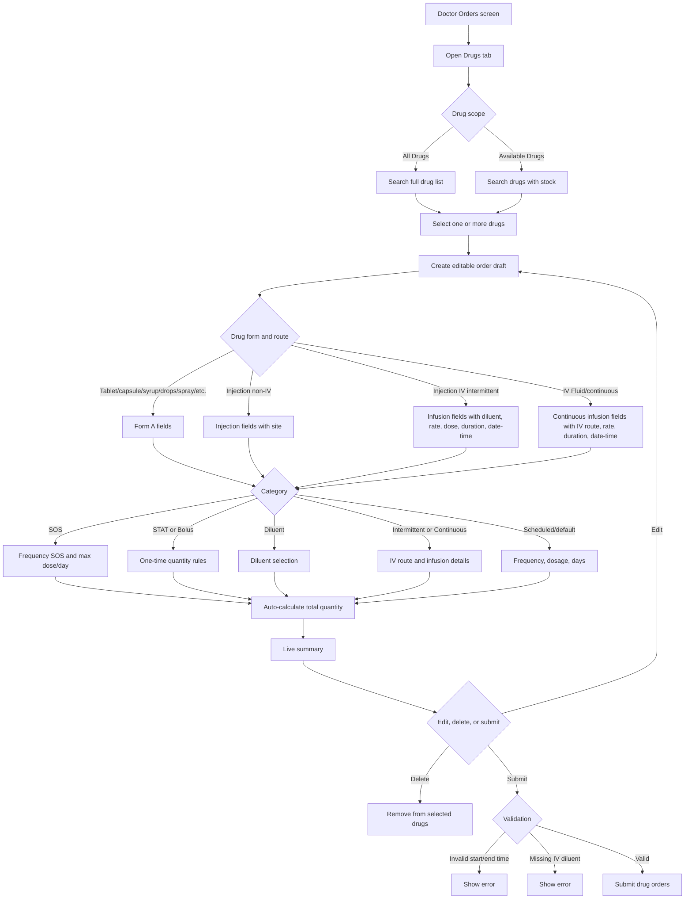
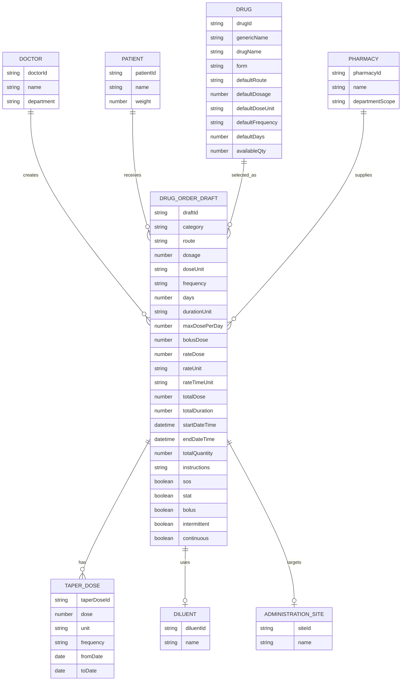

# Plasmit Hospital HMS

Enterprise-grade Hospital Management System frontend for a single-hospital, multi-department workflow. The project is currently UI/frontend only and uses realistic static mock data.

## Project Status

- Frontend-only HMS interface.
- No backend APIs, database, authentication service, external integrations, payment processing, device feeds, or AI services are implemented.
- All workflows use seeded mock data from `src/data`.
- Phase-wise planning and detailed implementation documents are available in `docs`.
- Current UI includes shell, theme system, role-aware navigation, clinical workflows, diagnostics, billing, inventory, HR/admin/reporting, integrations, compliance, mobile previews, AI placeholders, and final QA surfaces.

## Core Stack

- Next.js App Router
- TypeScript
- Tailwind CSS
- Radix UI primitives
- TanStack Table
- Framer Motion
- Lucide Icons
- Recharts
- next-themes
- Sonner toast notifications

## Key UI Capabilities

- Responsive app shell for phone, tablet, laptop, desktop, and wide desktop.
- Sticky top header and desktop sidebar navigation.
- Mobile navigation drawer.
- Light, dark, and system theme modes.
- Dynamic primary color presets and custom primary color support.
- Compact and comfortable density modes.
- Expanded, collapsed, and auto sidebar preferences.
- Role-aware navigation visibility.
- Reusable drawers, cards, tables, tabs, status pills, alerts, empty states, and sticky action bars.
- Static loading, empty, error, blocked, read-only, warning, and operational states.
- Print-safe UI patterns for clinical, audit, billing, QA, and report surfaces.

## Doctor Orders - Drug Order Workflow

The doctor order tab follows the medication order specification and screen deck in `D:\Samiksha\Plasmit\Drug Doc`. The current implementation is UI-only and uses static mock drug data, but the workflow shape matches the documented screen behavior:

- Doctor opens `Orders > Drugs`.
- Drug picker supports `All Drugs` and `Available Drugs`.
- Doctor searches by drug, generic name, form, available quantity, or pharmacy.
- Selected drugs create editable order drafts.
- Order details render form-based fields for tablet/capsule/syrup/drops/spray/inhaler/ointment/patch/lozenge, injection, IV intermittent infusion, and IV fluid/continuous infusion.
- Category controls support `SOS`, `STAT`, `Bolus`, `Diluent`, `Intermittent`, and `Continuous`.
- Route rules are driven by drug form: non-injection forms use oral/topical/eye/ear/nasal/etc., injection uses IM/SC/spinal/IV, and intermittent/continuous orders force IV.
- The form captures frequency, dosage, units, days, site, diluent, max dose/day, rate, total dose, total duration, start/end date-time, dosage calculation flags, instructions, and taper dose rows.
- Total quantity auto-calculates from dosage or total dose, frequency, and duration where applicable.
- Summary updates in real time and allows edit/delete before submit.
- Submit validates start/end time and required IV diluent, then confirms the selected drug orders.





## Documentation

Phase planning lives in `docs`:

- `docs/hms-ui-phase-plan.md`
- `docs/phase-1-ui-foundation-detailed.md`
- `docs/phase-2-auth-security-master-setup-detailed.md`
- `docs/phase-3-patient-management-detailed.md`
- `docs/phase-4-appointments-scheduling-front-office-detailed.md`
- `docs/phase-5-opd-clinical-workflow-detailed.md`
- `docs/phase-6-ipd-admission-nursing-emergency-detailed.md`
- `docs/phase-7-emr-ehr-clinical-continuity-detailed.md`
- `docs/phase-8-laboratory-radiology-detailed.md`
- `docs/phase-9-pharmacy-inventory-store-ot-detailed.md`
- `docs/phase-10-billing-finance-insurance-tpa-detailed.md`
- `docs/phase-11-hrms-admin-communication-reports-detailed.md`
- `docs/phase-12-integrations-compliance-mobile-ai-final-optimization-detailed.md`

## Local Development

Install dependencies:

```bash
npm install
```

Start the development server:

```bash
npm run dev
```

Use a specific port, for example the current local browser workflow:

```bash
npm run dev -- -p 3003
```

Open:

```text
http://localhost:3003/dashboard
```

## Scripts

```bash
npm run dev
npm run build
npm run start
npm run lint
npm run typecheck
```

Recommended verification before pushing:

```bash
npm run typecheck
npm run lint
npm run build
```

## Folder Structure

```text
src/
  app/          App Router routes and route groups
  components/   Shared shell, providers, theme, and UI primitives
  config/       Theme and application configuration
  data/         Static mock data for all modules
  features/     Feature-based UI modules and workflow pages
  lib/          Shared utilities
  types/        Shared TypeScript types
docs/           Phase plan and detailed phase documents
```

## Main Route Groups

- `/dashboard`
- `/settings/ui`
- `/admin/*`
- `/patients/*`
- `/appointments/*`
- `/opd/*`
- `/ipd/*`
- `/emergency/*`
- `/emr/*`
- `/laboratory/*`
- `/radiology/*`
- `/pharmacy/*`
- `/inventory/*`
- `/ot/*`
- `/billing/*`
- `/finance/*`
- `/insurance/*`
- `/hrms/*`
- `/administration/*`
- `/communication/*`
- `/reports/*`
- `/integrations/*`
- `/security-compliance/*`
- `/mobile/*`
- `/remote-monitoring`
- `/smart-healthcare/*`
- `/final-qa/*`

## Implementation Rules

- Keep the project UI-only unless a future phase explicitly adds backend work.
- Use static mock data only for current workflows.
- Preserve the shared design system and semantic theme tokens.
- Avoid page-specific color systems.
- Keep navigation shallow and workflow-oriented.
- Keep dense clinical and operational tables inside their own scroll containers.
- Do not introduce page-level horizontal scrolling.
- Keep shell navigation, page context, and action controls sticky where required.
- Prefer feature-based folders and reusable components over one-off UI.

## Git Notes

Running the Next.js dev server may update `next-env.d.ts` to reference `.next/dev/types/routes.d.ts`. That is a generated local development change and should normally not be committed unless intentionally updating generated type behavior.

## Deployment

This is a standard Next.js application. Build with:

```bash
npm run build
```

Run the production server locally with:

```bash
npm run start
```

No environment variables are required for the current static frontend implementation.
